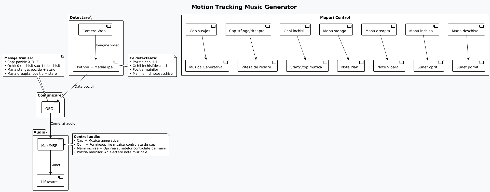
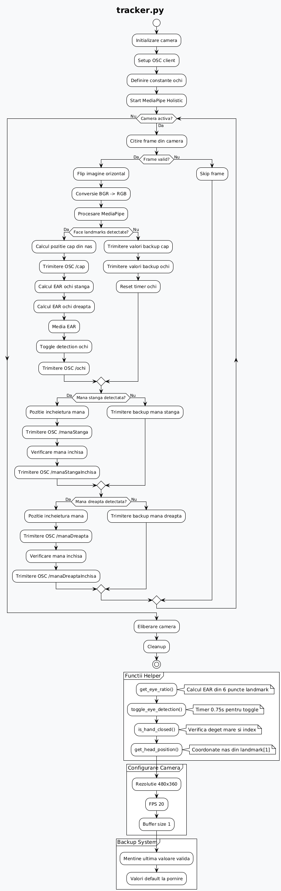

# Motion Tracking Music Generator

Un sistem interactiv de muzica generativa care transforma miscarile corpului in sunet folosind camera web. Controleaza muzica prin miscarea capului, ochilor si mainilor in timp real.

## Arhitectura Sistemului

### Diagrama Generala


### Fluxul Scriptului Python


## Instalare

### Cerinte
- Python
- Max/MSP
- Camera web
- Boxe/casti

### Setup Python
```bash
pip install mediapipe opencv-python python-osc
```

### Fisiere Audio
Pune fisierele WAV in folderul proiectului:
- `A4.wav`, `C4.wav`, `D4.wav`, `E4.wav`, `F4.wav`, `G4.wav`
- `VA4.wav`, `VC4.wav`, `VD4.wav`, `VE4.wav`, `VF4.wav`, `VG4.wav`

### Pornire Automata
Foloseste `start.bat` pentru pornire automata - deschide Max/MSP, asteapta 10 secunde, apoi porneste tracking-ul.

## Utilizare

### Pornire Manuala
1. Deschide Max/MSP si patch-ul `imeciss.maxpat`
2. Ruleaza scriptul Python:
   ```bash
   python tracker.py
   ```
3. Pozitioneaza-te la 1-2 metri de camera

### Controluri
- **Cap**: Miscarea pe X controleaza ritmul, pe Y controleaza melodia
- **Ochi**: Tine ochii inchisi 0.75 secunde pentru toggle on/off
- **Maini**: Pozitia controleaza instrumentele, inchis/deschis = pornit/oprit

### Comunicatie
Scriptul trimite coordonate via OSC pe portul 8999 catre Max/MSP:
- `/cap [x, y, z]` - pozitia capului
- `/ochi [0/1]` - starea ochilor
- `/manaStanga [x, y, z]` - pozitia mainii stangi
- `/manaStangaInchisa [0/1]` - starea mainii stangi
- `/manaDreapta [x, y, z]` - pozitia mainii drepte
- `/manaDreaptaInchisa [0/1]` - starea mainii drepte

## Istoric

**Etapa 1 - Script Draft Initial**
- Implementare de baza MediaPipe pentru detectarea fetei
- Comunicatie Python → Max/MSP

**Etapa 2 - Dezvoltare Patch Max/MSP**
- Crearea patch-ului `imeciss.maxpat`

**Etapa 3 - Tentativa Implementare Nativa Max**
- Am incercat implementarea trackingului folosind [acest exemplu cu jweb](https://github.com/lysdexic-audio/jweb-hands-landmarker)
am incercat si sa folosesc exemplele din [acest repository](https://github.com/lysdexic-audio/jweb-facemesh)

**Etapa 4 - Optimizari si Finalizare**
- Implementare Eye Aspect Ratio (EAR) pentru detectare clipire
- Adaugare sistem toggle pentru controlul prin ochi (0.75s)
- Optimizare detectare închidere maini cu landmarks thumb/index
- Implementare sistem backup pentru continuitate


## Referinte

### Hand Tracking & Gesture Detection
- [Gesture Volume Control](https://github.com/pratham-bhatnagar/Gesture-Volume-Control) - Control volum prin distanta
- [Hand Gesture Recognition with MLP](https://github.com/kinivi/hand-gesture-recognition-mediapipe) - Recunoastere gesturi maini
- [Simple Hand Gesture Recognition](https://gist.github.com/TheJLifeX/74958cc59db477a91837244ff598ef4a) - Detectare gesturi simple

### Eye Blink Detection & EAR
- [Eye Blink Detection with EAR](https://github.com/Pushtogithub23/Eye-Blink-Detection-using-MediaPipe-and-OpenCV) - EAR calculation
- [Advanced Gaze Tracker](https://github.com/alireza787b/Python-Gaze-Face-Tracker) - Tracking complet ochi

### Documentatie Oficiala
- [MediaPipe Solutions Guide](https://developers.google.com/mediapipe/solutions/guide) - Ghid oficial Google MediaPipe
- [Hand Landmarks Detection](https://developers.google.com/mediapipe/solutions/vision/hand_landmarker) - Detectare landmarks maini
- [Face Landmarks Detection](https://developers.google.com/mediapipe/solutions/vision/face_landmarker) - Detectare landmarks fata
